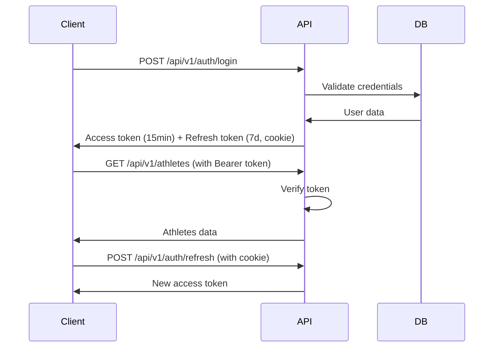

# RowLab API Reference

Complete API documentation for RowLab v1 REST API.

**Base URL:** `http://localhost:8000/api/v1` (development)
**Authentication:** JWT Bearer Token
**Response Format:** JSON

---

## Table of Contents

- [Overview](#overview)
- [Authentication](#authentication)
- [Endpoint Categories](#endpoint-categories)
- [Common Patterns](#common-patterns)
- [Error Handling](#error-handling)
- [Rate Limiting](#rate-limiting)
- [Detailed Documentation](#detailed-documentation)

---

## Overview

The RowLab API follows RESTful conventions with a few enhancements for real-time features and batch operations.

### Key Features

- **Multi-tenant:** All resources are scoped to teams
- **Type-safe:** TypeScript types generated from Prisma schema
- **Real-time:** WebSocket support for collaboration
- **Optimistic:** Support for optimistic UI updates
- **Batch operations:** Import/export endpoints for bulk data

### API Versioning

All endpoints are under `/api/v1/` namespace. Breaking changes will be released as `/api/v2/`.

---

## Authentication

### JWT Authentication Flow



### Token Types

**Access Token (JWT):**
- Lifetime: 15 minutes
- Storage: Client memory only (not localStorage)
- Header: `Authorization: Bearer <token>`
- Payload: `{ userId, activeTeamId, activeTeamRole }`

**Refresh Token:**
- Lifetime: 7 days
- Storage: HTTP-only cookie
- Used to obtain new access tokens
- Automatically rotated on refresh

### Authentication Endpoints

#### `POST /api/v1/auth/register`

Create a new user account.

**Request:**
```json
{
  "email": "coach@example.com",
  "password": "securePassword123",
  "name": "John Smith"
}
```

**Response (201):**
```json
{
  "success": true,
  "data": {
    "user": {
      "id": "uuid",
      "email": "coach@example.com",
      "name": "John Smith"
    }
  }
}
```

#### `POST /api/v1/auth/login`

Authenticate user and receive tokens.

**Request:**
```json
{
  "email": "coach@example.com",
  "password": "securePassword123"
}
```

**Response (200):**
```json
{
  "success": true,
  "data": {
    "user": {
      "id": "uuid",
      "email": "coach@example.com",
      "name": "John Smith"
    },
    "teams": [
      {
        "id": "team-uuid",
        "name": "Varsity Rowing",
        "role": "OWNER"
      }
    ],
    "activeTeamId": "team-uuid",
    "accessToken": "eyJhbGc..."
  }
}
```

**Set-Cookie:** `refreshToken=...; HttpOnly; Secure; SameSite=Strict`

#### `POST /api/v1/auth/refresh`

Obtain a new access token using refresh token cookie.

**Request:** (No body, refresh token in cookie)

**Response (200):**
```json
{
  "success": true,
  "data": {
    "accessToken": "eyJhbGc..."
  }
}
```

#### `POST /api/v1/auth/logout`

Revoke refresh token and end session.

**Headers:** `Authorization: Bearer <token>`

**Response (200):**
```json
{
  "success": true,
  "data": {
    "message": "Logged out successfully"
  }
}
```

#### `POST /api/v1/auth/switch-team`

Switch active team context.

**Request:**
```json
{
  "teamId": "uuid"
}
```

**Response (200):**
```json
{
  "success": true,
  "data": {
    "accessToken": "eyJhbGc...",
    "team": {
      "id": "uuid",
      "name": "JV Rowing",
      "role": "COACH"
    }
  }
}
```

---

## Endpoint Categories

### Core Resources

#### Teams
- `POST /api/v1/teams` - Create team
- `GET /api/v1/teams/:id` - Get team details
- `PATCH /api/v1/teams/:id` - Update team settings
- `GET /api/v1/teams/:id/members` - List team members
- `PATCH /api/v1/teams/:id/members/:userId` - Update member role
- `DELETE /api/v1/teams/:id/members/:userId` - Remove member
- `POST /api/v1/teams/join/:code` - Join team by invite code

#### Athletes
- `GET /api/v1/athletes` - List all athletes
- `POST /api/v1/athletes` - Create athlete
- `GET /api/v1/athletes/:id` - Get athlete details
- `PATCH /api/v1/athletes/:id` - Update athlete
- `DELETE /api/v1/athletes/:id` - Delete athlete
- `POST /api/v1/athletes/bulk-import` - Bulk import from CSV

#### Workouts (User-Scoped - v4.0)
- `GET /api/u/workouts` - Get user's workout feed
- `POST /api/u/workouts` - Create workout
- `GET /api/u/workouts/:id` - Get workout details
- `PATCH /api/u/workouts/:id` - Update workout
- `DELETE /api/u/workouts/:id` - Delete workout
- `GET /api/u/stats` - Get user statistics

### Performance Tracking

#### Erg Tests
- `GET /api/v1/erg-tests` - List erg tests
- `POST /api/v1/erg-tests` - Create erg test
- `GET /api/v1/erg-tests/:id` - Get test details
- `PATCH /api/v1/erg-tests/:id` - Update test
- `DELETE /api/v1/erg-tests/:id` - Delete test

#### Workouts (Legacy Team-Scoped)
- `GET /api/v1/workouts` - List workouts
- `POST /api/v1/workouts` - Create workout
- `GET /api/v1/workouts/:id` - Get workout details

### Lineup Management

#### Lineups
- `GET /api/v1/lineups` - List lineups
- `POST /api/v1/lineups` - Create lineup
- `GET /api/v1/lineups/:id` - Get lineup details
- `PATCH /api/v1/lineups/:id` - Update lineup
- `DELETE /api/v1/lineups/:id` - Delete lineup

#### Shells
- `GET /api/v1/v1/shells` - List shells
- `POST /api/v1/v1/shells` - Create shell
- `PATCH /api/v1/v1/shells/:id` - Update shell
- `DELETE /api/v1/v1/shells/:id` - Delete shell

#### Boat Configurations
- `GET /api/v1/boat-configs` - List boat configs
- `POST /api/v1/boat-configs` - Create config
- `PATCH /api/v1/boat-configs/:id` - Update config
- `DELETE /api/v1/boat-configs/:id` - Delete config

### Competition

#### Seat Racing
- `GET /api/v1/seat-races` - List seat race sessions
- `POST /api/v1/seat-races` - Create session
- `GET /api/v1/seat-races/:id` - Get session details
- `POST /api/v1/seat-races/:id/pieces` - Add piece
- `PATCH /api/v1/seat-races/:id/pieces/:pieceId` - Update piece

#### Regattas
- `GET /api/v1/regattas` - List regattas
- `POST /api/v1/regattas` - Create regatta
- `GET /api/v1/regattas/:id` - Get regatta details
- `POST /api/v1/regattas/:id/races` - Add race
- `POST /api/v1/regattas/:id/races/:raceId/results` - Add result

#### Rankings
- `GET /api/v1/rankings` - Get team rankings
- `GET /api/v1/ratings` - Get athlete ratings
- `GET /api/v1/team-rankings` - Get inter-team rankings

### Training

#### Training Plans
- `GET /api/v1/training-plans` - List plans
- `POST /api/v1/training-plans` - Create plan
- `GET /api/v1/training-plans/:id` - Get plan details
- `POST /api/v1/training-plans/:id/workouts` - Add workout
- `POST /api/v1/training-plans/:id/assign` - Assign to athletes

#### Calendar
- `GET /api/v1/calendar` - Get calendar events
- `POST /api/v1/calendar` - Create event
- `PATCH /api/v1/calendar/:id` - Update event
- `DELETE /api/v1/calendar/:id` - Delete event

#### Water Sessions
- `GET /api/v1/water-sessions` - List sessions
- `POST /api/v1/water-sessions` - Create session
- `POST /api/v1/water-sessions/:id/boats` - Add boat session

### Communication

#### Announcements
- `GET /api/v1/announcements` - List announcements
- `POST /api/v1/announcements` - Create announcement
- `PATCH /api/v1/announcements/:id` - Update announcement
- `DELETE /api/v1/announcements/:id` - Delete announcement
- `POST /api/v1/announcements/:id/read` - Mark as read

### Integrations

#### Concept2
- `POST /api/v1/concept2/connect` - Get OAuth URL
- `GET /api/v1/concept2/callback` - OAuth callback
- `GET /api/v1/concept2/status` - Get connection status
- `POST /api/v1/concept2/sync` - Sync workouts
- `DELETE /api/v1/concept2/disconnect` - Disconnect

#### Strava
- `GET /api/v1/strava/auth-url` - Get OAuth URL
- `GET /api/v1/strava/callback` - OAuth callback
- `GET /api/v1/strava/status` - Get connection status
- `POST /api/v1/strava/sync` - Sync activities
- `DELETE /api/v1/strava/disconnect` - Disconnect

#### AI Lineup Optimization
- `POST /api/v1/ai-lineup/optimize` - Get AI lineup suggestions

### Administration

#### Settings
- `GET /api/v1/settings` - Get user settings
- `PATCH /api/v1/settings` - Update user settings

#### Subscriptions
- `GET /api/v1/subscriptions` - Get subscription
- `POST /api/v1/subscriptions/checkout` - Create checkout session
- `POST /api/v1/subscriptions/webhook` - Stripe webhook handler

---

## Common Patterns

### Response Format

**Success Response:**
```json
{
  "success": true,
  "data": {
    // Resource data
  }
}
```

**Error Response:**
```json
{
  "success": false,
  "error": {
    "code": "ERROR_CODE",
    "message": "Human-readable error message",
    "details": [...]  // Optional validation errors
  }
}
```

### Pagination

Large result sets support pagination:

```http
GET /api/v1/athletes?page=1&limit=20
```

**Response:**
```json
{
  "success": true,
  "data": {
    "athletes": [...],
    "pagination": {
      "page": 1,
      "limit": 20,
      "total": 150,
      "totalPages": 8
    }
  }
}
```

### Filtering

```http
GET /api/v1/erg-tests?testType=2k&athleteId=uuid&fromDate=2025-01-01
```

### Sorting

```http
GET /api/v1/athletes?sortBy=lastName&order=asc
```

### Field Selection

Request only specific fields:

```http
GET /api/v1/athletes?fields=id,firstName,lastName,side
```

---

## Error Handling

### HTTP Status Codes

| Code | Meaning | When Used |
|------|---------|-----------|
| 200 | OK | Successful GET, PATCH, DELETE |
| 201 | Created | Successful POST |
| 400 | Bad Request | Invalid input, validation errors |
| 401 | Unauthorized | Missing or invalid auth token |
| 403 | Forbidden | Insufficient permissions |
| 404 | Not Found | Resource doesn't exist |
| 409 | Conflict | Duplicate resource |
| 429 | Too Many Requests | Rate limit exceeded |
| 500 | Internal Server Error | Unexpected server error |

### Error Codes

| Code | Description |
|------|-------------|
| `VALIDATION_ERROR` | Request body/params failed validation |
| `NO_TOKEN` | No authentication token provided |
| `INVALID_TOKEN` | Token expired or malformed |
| `NO_TEAM` | No active team selected |
| `FORBIDDEN` | User lacks required permissions |
| `NOT_FOUND` | Resource not found |
| `DUPLICATE` | Resource already exists |
| `RATE_LIMITED` | Too many requests |
| `SERVER_ERROR` | Internal server error |

### Example Error Responses

**Validation Error (400):**
```json
{
  "success": false,
  "error": {
    "code": "VALIDATION_ERROR",
    "message": "Validation failed",
    "details": [
      {
        "field": "email",
        "message": "Invalid email format"
      },
      {
        "field": "password",
        "message": "Password must be at least 8 characters"
      }
    ]
  }
}
```

**Authentication Error (401):**
```json
{
  "success": false,
  "error": {
    "code": "INVALID_TOKEN",
    "message": "JWT token has expired"
  }
}
```

---

## Rate Limiting

Rate limits protect the API from abuse and ensure fair usage.

### Limits by Endpoint Category

| Category | Limit | Window |
|----------|-------|--------|
| Global | 100 requests | 1 minute |
| Authentication | 5 requests | 1 minute |
| AI Features | 20 requests | 1 minute |
| General API | 60 requests | 1 minute |

### Rate Limit Headers

Responses include rate limit information:

```http
X-RateLimit-Limit: 60
X-RateLimit-Remaining: 45
X-RateLimit-Reset: 1644768000
```

### Exceeding Rate Limits

When rate limit is exceeded:

**Response (429):**
```json
{
  "success": false,
  "error": {
    "code": "RATE_LIMITED",
    "message": "Too many requests, please try again later",
    "retryAfter": 60
  }
}
```

**Headers:**
```http
Retry-After: 60
X-RateLimit-Limit: 60
X-RateLimit-Remaining: 0
X-RateLimit-Reset: 1644768000
```

---

## Detailed Documentation

For detailed endpoint documentation, see:

### API Endpoint Documentation

- **[Authentication](./api/authentication.md)** - Complete auth flow documentation
- **[Athletes](./api/athletes.md)** - Athlete management endpoints
- **[Backend API Reference](./BACKEND_API.md)** - Comprehensive API guide

### Database and Services

- **[Database Schema](./DATABASE_SCHEMA.md)** - Complete database documentation
- **[Services Documentation](./services/README.md)** - Business logic layer

### Frontend Integration

- **[Frontend Architecture](./FRONTEND_ARCHITECTURE.md)** - React app structure
- **[Component Documentation](./components/README.md)** - UI components

---

## Client Examples

### JavaScript/TypeScript (axios)

```typescript
import axios from 'axios';

const api = axios.create({
  baseURL: 'http://localhost:8000/api/v1',
  withCredentials: true, // For refresh token cookie
});

// Add auth token to requests
api.interceptors.request.use((config) => {
  const token = localStorage.getItem('accessToken');
  if (token) {
    config.headers.Authorization = `Bearer ${token}`;
  }
  return config;
});

// Refresh token on 401
api.interceptors.response.use(
  (response) => response,
  async (error) => {
    if (error.response?.status === 401) {
      const { data } = await api.post('/auth/refresh');
      localStorage.setItem('accessToken', data.data.accessToken);

      // Retry original request
      error.config.headers.Authorization = `Bearer ${data.data.accessToken}`;
      return api(error.config);
    }
    return Promise.reject(error);
  }
);

// Usage
async function getAthletes() {
  const { data } = await api.get('/athletes');
  return data.data.athletes;
}
```

### cURL

```bash
# Login
curl -X POST http://localhost:8000/api/v1/auth/login \
  -H "Content-Type: application/json" \
  -d '{"email":"user@example.com","password":"password"}' \
  -c cookies.txt

# Extract token
export TOKEN=$(curl -s -X POST http://localhost:8000/api/v1/auth/login \
  -H "Content-Type: application/json" \
  -d '{"email":"user@example.com","password":"password"}' \
  | jq -r '.data.accessToken')

# Authenticated request
curl http://localhost:8000/api/v1/athletes \
  -H "Authorization: Bearer $TOKEN"

# Refresh token
curl -X POST http://localhost:8000/api/v1/auth/refresh \
  -b cookies.txt
```

---

## WebSocket API (Socket.IO)

### Connection

```typescript
import { io } from 'socket.io-client';

const socket = io('http://localhost:8000', {
  auth: {
    token: accessToken,
  },
});

socket.on('connect', () => {
  console.log('Connected:', socket.id);
});
```

### Lineup Collaboration

```typescript
// Join lineup room
socket.emit('lineup:join', { lineupId: 'uuid' });

// Listen for updates
socket.on('lineup:updated', (data) => {
  console.log('Lineup changed:', data);
});

// Send update
socket.emit('lineup:update', {
  boatId: 'uuid',
  seatNumber: 5,
  athleteId: 'uuid',
});

// Presence
socket.on('presence:update', (users) => {
  console.log('Online users:', users);
});
```

### Race-Day Updates

```typescript
// Join regatta room
socket.emit('race:join', { regattaId: 'uuid' });

// Listen for results
socket.on('race:result', (result) => {
  console.log('Race result:', result);
});
```

---

## API Changelog

### v1.0 (Current)

**Release Date:** 2025-01-20

**Features:**
- Multi-tenant team management
- JWT authentication with refresh tokens
- Athlete & erg test management
- Training plans (Phase 6)
- Concept2 & Strava OAuth
- Seat racing with ELO ratings
- AI lineup optimizer
- Subscription management
- Real-time collaboration

**Breaking Changes:** None (initial release)

### Future Versions

**Planned for v2.0:**
- GraphQL API alongside REST
- Batch mutation endpoints
- Enhanced filtering with JSON operators
- Webhook subscriptions for events

---

## Support

**Documentation Issues:**
- GitHub Issues: https://github.com/swdrow/RowLab/issues
- Label: `documentation`

**API Questions:**
- Check existing issues first
- Provide example requests and responses
- Include error messages

---

**Last Updated:** 2026-02-14
**API Version:** v1.0
**Maintained By:** RowLab Development Team
