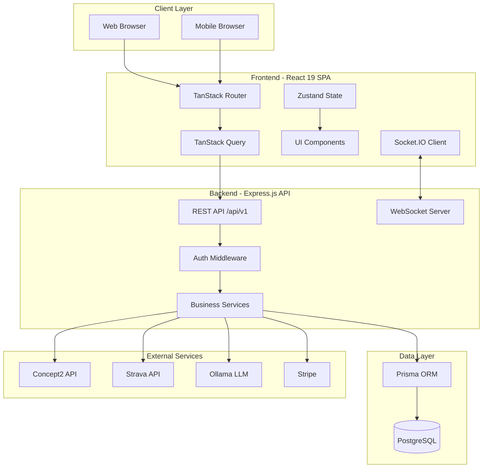
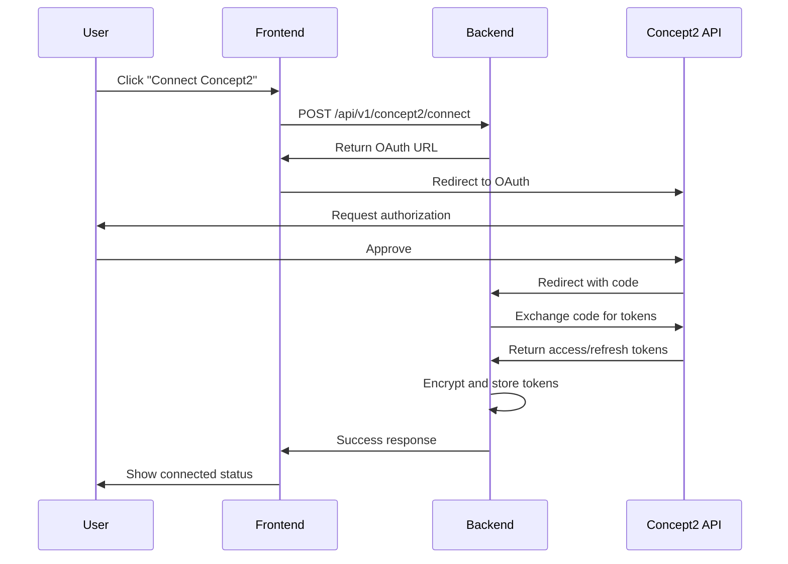

# RowLab System Architecture

## Overview

RowLab is a modern, athlete-first rowing team management SaaS built with a multi-tenant architecture. The platform provides comprehensive tools for team management, athlete profiles, erg tracking, lineup optimization, seat racing, training plans, and race-day operations.

**Current Version:** v4.0 (React 19, TanStack Router, Tailwind v4)
**Architecture Pattern:** Monolithic with real-time capabilities
**Deployment Model:** Self-hosted or managed service

---

## High-Level Architecture



---

## Frontend Architecture

### Technology Stack

| Layer | Technology | Purpose |
|-------|-----------|---------|
| **Framework** | React 19 | UI rendering with concurrent features |
| **Router** | TanStack Router | Type-safe file-based routing |
| **State** | Zustand + TanStack Query | Client state + server state |
| **Styling** | Tailwind CSS v4 | Utility-first CSS with Canvas design system |
| **Build** | Vite 5 | Fast dev server and optimized builds |
| **Testing** | Vitest + Testing Library | Unit and integration tests |

### Application Structure

```
src/
├── v2/                         # Current v4.0 architecture
│   ├── routes/                 # TanStack Router file-based routes
│   │   ├── __root.tsx         # Root layout with query provider
│   │   ├── index.tsx          # Landing page
│   │   ├── app/               # Authenticated routes
│   │   │   ├── _layout.tsx    # App shell (sidebar, nav)
│   │   │   ├── dashboard.tsx  # Personal dashboard
│   │   │   ├── me/            # User profile routes
│   │   │   ├── workouts/      # Workout management
│   │   │   ├── team/          # Team management
│   │   │   └── ...
│   ├── components/            # Reusable components
│   │   ├── ui/               # Design system primitives
│   │   ├── layouts/          # Layout components
│   │   └── features/         # Feature-specific components
│   ├── lib/                  # Utilities and helpers
│   │   ├── api.ts           # API client configuration
│   │   ├── queries/         # TanStack Query hooks
│   │   └── utils/           # Shared utilities
│   └── types/               # TypeScript types
├── store/                    # Zustand global state
└── legacy/                   # V1 codebase (React Router 6)
```

### State Management

**Server State (TanStack Query v5):**
- API data fetching with automatic caching
- Optimistic updates for mutations
- Background refetching and stale-while-revalidate
- Query key factories for consistent invalidation

**Client State (Zustand):**
- Authentication and session management
- UI preferences and settings
- Real-time collaboration state
- Temporary form state and drafts

### Routing Strategy

TanStack Router provides file-based routing with type-safe navigation:

```
/                           → Landing page
/app                        → Dashboard (athlete view)
/app/team                   → Team management
/app/lineup                 → Lineup builder
/app/erg                    → Erg data tracking
/app/workouts               → Workout management
/app/me                     → Personal profile
/legacy/*                   → V1 routes (legacy React Router)
```

### Design System - Canvas

**Core Principles:**
- Warm copper accent palette
- Glass-morphic cards with subtle gradients
- Chamfered (beveled) panels for premium feel
- Spring-based physics animations
- Skeleton loaders (no spinners)

**Token System:**
```css
--color-canvas-bg: oklch(0.15 0.02 270)
--color-accent-warm: oklch(0.65 0.15 45)  /* Warm copper */
--glass-border: oklch(1 0 0 / 0.1)
--surface-raised: oklch(0.2 0.02 270)
```

---

## Backend Architecture

### Technology Stack

| Layer | Technology | Purpose |
|-------|-----------|---------|
| **Runtime** | Node.js 18+ | Server execution |
| **Framework** | Express.js | REST API routing |
| **Database** | PostgreSQL 14+ | Relational data storage |
| **ORM** | Prisma 7 | Type-safe database access |
| **Auth** | JWT + Refresh Tokens | Stateless authentication |
| **Real-time** | Socket.IO | Live collaboration |
| **Logging** | Winston | Structured logging |

### Service Layer

Business logic is organized into domain services:

```
server/services/
├── authService.js           # User authentication
├── tokenService.js          # JWT token management
├── athleteService.js        # Athlete CRUD
├── teamService.js           # Team management
├── ergTestService.js        # Erg test tracking
├── workoutService.js        # Workout management
├── trainingPlanService.js   # Training plans
├── lineupService.js         # Lineup optimization
├── seatRaceService.js       # Seat racing and ELO
├── concept2Service.js       # Concept2 integration
├── stravaService.js         # Strava integration
├── aiLineupService.js       # AI-powered lineup suggestions
└── backgroundSyncService.js # Automated data sync
```

### API Routes

All routes are namespaced under `/api/v1/` for versioning:

```
/api/v1/auth/*               # Authentication
/api/v1/teams/*              # Team management
/api/v1/athletes/*           # Athlete profiles
/api/v1/workouts/*           # Workout tracking
/api/v1/erg-tests/*          # Erg test management
/api/v1/lineups/*            # Lineup builder
/api/v1/seat-races/*         # Seat racing
/api/v1/training-plans/*     # Training plans
/api/v1/regattas/*           # Race results
/api/v1/concept2/*           # Concept2 integration
/api/v1/strava/*             # Strava integration
/api/v1/u/*                  # User-scoped routes (v4.0)
```

### Middleware Stack

```javascript
app.use(securityHeaders);      // Helmet.js security
app.use(corsOptions);          // CORS configuration
app.use(globalLimiter);        // Rate limiting
app.use(express.json());       // Body parsing
app.use(cookieParser());       // Cookie handling
app.use(requestLogger);        // Winston logging
app.use(authenticateToken);    // JWT verification
app.use(teamIsolation);        // Multi-tenant isolation
```

---

## Database Layer

### Schema Overview

**Total Models:** 66
**Core Domains:** 8

```
Core:
├── User, Team, TeamMember
├── Athlete (managed vs linked)
└── RefreshToken, Invitation

Performance:
├── ErgTest, Workout
├── WorkoutTelemetry
└── AthleteRating

Training:
├── TrainingPlan, PlannedWorkout
├── WorkoutAssignment, WorkoutCompletion
└── CalendarEvent

Competition:
├── Lineup, LineupAssignment
├── SeatRaceSession, SeatRacePiece
├── Regatta, Race, RaceResult
└── TeamSpeedEstimate

Integrations:
├── Concept2Auth, StravaAuth
└── Subscription (Stripe)

Communication:
├── Announcement, AnnouncementRead
└── WaterSession, BoatSession

Equipment:
├── Shell, OarSet, BoatConfig
└── RiggingProfile

Gamification:
├── Challenge, Achievement
├── PersonalRecord, Streak
└── TeamActivity
```

### Multi-Tenancy

All team-scoped data includes a `teamId` foreign key:

```sql
-- Example: Athletes are isolated by team
SELECT * FROM athletes
WHERE teamId = :activeTeamId
  AND lastName = :lastName;

-- Index for performance
CREATE INDEX idx_athletes_team ON athletes(teamId, lastName);
```

**Key Isolation Pattern:**
- Middleware attaches `req.teamFilter = { teamId }`
- All Prisma queries automatically scoped
- Cross-team access prevented at DB level

### Prisma ORM

**Benefits:**
- Type-safe queries with autocomplete
- Automatic migrations from schema changes
- Connection pooling and query optimization
- Built-in relation loading

**Example Service Method:**
```typescript
async function getAthleteWithStats(teamId: string, athleteId: string) {
  return prisma.athlete.findUnique({
    where: { id: athleteId, teamId },
    include: {
      ergTests: {
        where: { testType: '2k' },
        orderBy: { testDate: 'desc' },
        take: 1,
      },
      ratings: {
        where: { ratingType: 'combined' },
      },
    },
  });
}
```

---

## Real-Time Layer (Socket.IO)

### Collaboration Features

**Live Lineup Editing:**
- Multi-user cursor positions
- Seat assignment broadcasts
- Optimistic updates with conflict resolution

**Presence System:**
- Online/offline status
- Active page indicators
- Typing indicators for chat

**Event Types:**
```typescript
// Client → Server
socket.emit('lineup:join', { lineupId });
socket.emit('lineup:update', { boatId, seatNumber, athleteId });

// Server → Client
socket.on('lineup:user-joined', { userId, userName });
socket.on('lineup:updated', { diff });
socket.on('presence:update', { users });
```

### Race-Day Socket

Real-time race updates during regattas:

```typescript
// Broadcast race result
io.to(`regatta:${regattaId}`).emit('race:result', {
  raceId,
  teamName,
  finishTime,
  place,
});
```

---

## Integration Layer

### Concept2 OAuth Flow



**Features:**
- Automatic workout sync via webhooks
- Manual sync on-demand
- Token refresh before expiration
- AES-256-GCM encryption for stored tokens

### Strava Integration

**Bidirectional Sync:**
1. **Strava → RowLab:** Import rowing activities
2. **Concept2 → Strava:** Upload erg workouts

**Sync Configuration:**
```json
{
  "syncEnabled": true,
  "c2ToStravaEnabled": true,
  "c2ToStravaTypes": {
    "rower": true,
    "bikeerg": false,
    "skierg": false
  }
}
```

### AI Integration (Ollama)

**Lineup Optimization:**
- Local LLM running phi4-mini-reasoning:3.8b
- Analyzes athlete stats, side preferences, ELO ratings
- Suggests optimal seat assignments
- Explains reasoning for each position

**Request Flow:**
```typescript
POST /api/v1/ai-lineup/optimize
{
  "boatClass": "8+",
  "athleteIds": [...],
  "constraints": {
    "requiredPairs": [...],
    "preferPort": [...],
    "preferStarboard": [...]
  }
}

Response:
{
  "lineup": [
    {
      "seatNumber": 1,
      "athleteId": "...",
      "side": "Port",
      "reasoning": "Strong erg scores, port preference"
    }
  ],
  "predictedSpeed": 6.42,
  "confidence": 0.85
}
```

---

## Security Architecture

### Authentication Flow

```
1. User Login:
   POST /api/v1/auth/login
   → Validate credentials (bcrypt)
   → Generate access token (JWT, 15min)
   → Generate refresh token (7d, HTTP-only cookie)
   → Return { accessToken, user, teams }

2. API Request:
   Authorization: Bearer <accessToken>
   → Middleware verifies token
   → Attach user context to request
   → Execute route handler

3. Token Refresh:
   POST /api/v1/auth/refresh
   Cookie: refreshToken=...
   → Validate refresh token
   → Generate new access token
   → Return { accessToken }

4. Logout:
   POST /api/v1/auth/logout
   → Revoke refresh token
   → Client clears access token
```

### Security Measures

**Transport Security:**
- HTTPS enforced in production
- Strict-Transport-Security headers
- CORS whitelist for allowed origins

**Input Validation:**
- express-validator on all inputs
- Zod schemas for type safety
- SQL injection prevention via Prisma

**Rate Limiting:**
```javascript
globalLimiter:  100 req/min   // All endpoints
authLimiter:      5 req/min   // Login/register
aiLimiter:       20 req/min   // AI features
apiLimiter:      60 req/min   // General API
```

**OWASP Protections:**
- Helmet.js security headers
- Content Security Policy (CSP)
- XSS protection via DOMPurify
- CSRF protection via SameSite cookies

---

## Performance Optimizations

### Frontend

**Code Splitting:**
- Route-based lazy loading with React.lazy()
- TanStack Router automatic code splitting
- Reduced initial bundle size by ~60%

**Caching Strategy:**
```typescript
// TanStack Query configuration
queryClient.setDefaultOptions({
  queries: {
    staleTime: 5 * 60 * 1000,      // 5 minutes
    gcTime: 10 * 60 * 1000,         // 10 minutes (formerly cacheTime)
    refetchOnWindowFocus: false,
    retry: 1,
  },
});
```

**Optimistic Updates:**
```typescript
const mutation = useMutation({
  mutationFn: updateAthlete,
  onMutate: async (newData) => {
    await queryClient.cancelQueries(['athletes']);
    const previous = queryClient.getQueryData(['athletes']);
    queryClient.setQueryData(['athletes'], (old) =>
      old.map((a) => a.id === newData.id ? newData : a)
    );
    return { previous };
  },
  onError: (err, newData, context) => {
    queryClient.setQueryData(['athletes'], context.previous);
  },
});
```

### Backend

**Database Indexing:**
```sql
-- Foreign key indexes for multi-tenant queries
CREATE INDEX idx_athletes_team ON athletes(teamId);
CREATE INDEX idx_workouts_athlete_date ON workouts(athleteId, date DESC);
CREATE INDEX idx_erg_tests_athlete_type ON erg_tests(athleteId, testType);
```

**Query Optimization:**
- Prisma select to limit returned fields
- Batch queries with Promise.all()
- Pagination for large datasets
- Connection pooling (default 10 connections)

**Caching:**
- In-memory caching for team settings
- Redis planned for session storage (future)

---

## Deployment Architecture

### Development Environment

```bash
# Frontend (Vite dev server)
http://localhost:3001

# Backend (Express)
http://localhost:8000

# Database
postgresql://localhost:5432/rowlab_dev
```

### Production Deployment

**Server Requirements:**
- Node.js 18+
- PostgreSQL 14+
- 2GB+ RAM
- HTTPS certificate

**Environment Variables:**
```bash
NODE_ENV=production
DATABASE_URL=postgresql://...
JWT_SECRET=<secure-random>
ENCRYPTION_KEY=<64-char-hex>
PORT=8000
```

**Process Management:**
- PM2 for process supervision
- Automatic restart on failure
- Log rotation and monitoring

**Reverse Proxy (Nginx):**
```nginx
server {
  listen 80;
  server_name rowlab.com;

  # Redirect to HTTPS
  return 301 https://$server_name$request_uri;
}

server {
  listen 443 ssl http2;
  server_name rowlab.com;

  ssl_certificate /path/to/cert.pem;
  ssl_certificate_key /path/to/key.pem;

  # Frontend static files
  location / {
    root /var/www/rowlab/dist;
    try_files $uri $uri/ /index.html;
  }

  # API proxy
  location /api {
    proxy_pass http://localhost:8000;
    proxy_http_version 1.1;
    proxy_set_header Upgrade $http_upgrade;
    proxy_set_header Connection 'upgrade';
  }
}
```

---

## Monitoring and Observability

### Logging (Winston)

**Log Levels:**
- `error`: Application errors
- `warn`: Warning conditions
- `info`: General information
- `debug`: Detailed debug information

**Log Transport:**
```javascript
const logger = winston.createLogger({
  level: NODE_ENV === 'production' ? 'info' : 'debug',
  format: winston.format.json(),
  transports: [
    new winston.transports.File({ filename: 'error.log', level: 'error' }),
    new winston.transports.File({ filename: 'combined.log' }),
    new winston.transports.Console({ format: winston.format.simple() }),
  ],
});
```

### Health Checks

```bash
# Health endpoint
GET /api/health
→ { status: "healthy", timestamp: "...", database: "connected" }

# Storage monitoring
GET /api/admin/storage
→ { totalSize: ..., freeSpace: ..., usage: {...} }
```

---

## Future Architecture Plans

### Planned Enhancements (v5.0+)

**Microservices Consideration:**
- Separate AI service for lineup optimization
- Dedicated sync service for integrations
- Message queue (RabbitMQ) for async jobs

**Caching Layer:**
- Redis for session storage
- Cache warming for frequently accessed data
- Distributed cache for multi-instance deployments

**Advanced Analytics:**
- Time-series database (TimescaleDB) for telemetry
- Data warehouse for historical analysis
- Real-time analytics dashboard

**Mobile Strategy:**
- React Native app sharing business logic
- Capacitor for hybrid approach
- Progressive Web App (PWA) features

---

## Technology Decisions

### Why React 19?

- Concurrent rendering for better UX
- Automatic batching of state updates
- useTransition for non-blocking updates
- Server Components (future consideration)

### Why TanStack Router?

- Type-safe routing with TypeScript
- File-based routing for better DX
- Built-in code splitting
- Superior performance vs React Router

### Why Prisma?

- Type-safe database access
- Schema-first development
- Automatic migrations
- Excellent TypeScript integration

### Why Socket.IO?

- Mature WebSocket library
- Automatic fallback to long-polling
- Room-based broadcasting
- Built-in reconnection logic

### Why PostgreSQL?

- ACID compliance for data integrity
- JSON/JSONB support for flexible schemas
- Excellent indexing performance
- Mature ecosystem and tooling

---

## Appendix: Key Files

### Frontend
- `src/v2/routes/__root.tsx` - App root with providers
- `src/v2/lib/api.ts` - API client configuration
- `src/v2/lib/queries/` - TanStack Query hooks
- `src/store/authStore.js` - Authentication state

### Backend
- `server/index.js` - Express app entry point
- `server/middleware/auth.js` - JWT authentication
- `server/services/` - Business logic layer
- `prisma/schema.prisma` - Database schema

### Configuration
- `vite.config.ts` - Vite build configuration
- `tailwind.config.js` - Tailwind CSS configuration
- `.env.example` - Environment variable template
- `package.json` - Dependencies and scripts

---

**Last Updated:** 2026-02-14
**Architecture Version:** v4.0
**Document Owner:** RowLab Development Team
